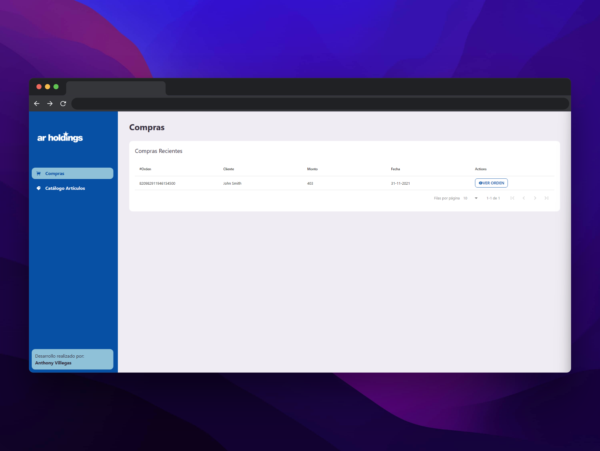

# Facturas y Productos de Shopify con Vite y React



Esta aplicación web construida con React y Vite, te permite consultar las facturas de compras y los productos de Shopify utilizando una API creada especialmente para esta tarea. La API está construida en Django y no requiere credenciales de uso.

## Requerimientos

Antes de continuar, asegúrate de tener instalado:

- Node.js v14 o superior
- npm v6 o superior
- Git

## Instalación

1. Clona este repositorio en tu máquina local:

```bash
git clone https://github.com/tu-usuario/tu-repositorio.git
```

2. Accede al directorio del proyecto:
3. Instala las dependencias:
4. Inicia la aplicación:
5. Abre la aplicación en tu navegador web, accediendo a la siguiente dirección:

## Uso

En la página principal de la aplicación, encontrarás dos botones: "Facturas" y "Productos".

## Facturas

Al hacer clic en el botón "Facturas", se mostrarán las facturas de compras realizadas en Shopify.

## Productos

Al hacer clic en el botón "Productos", se mostrarán los productos disponibles en Shopify.

## API

Esta aplicación utiliza una API creada especialmente para la consulta de facturas y productos de Shopify. La API está construida en Django y se encuentra alojada en un servidor remoto. No requiere credenciales de uso.

## Contribuciones

Este proyecto es de código abierto y las contribuciones son bienvenidas. Si quieres contribuir, por favor sigue los siguientes pasos:

1. Haz un fork de este repositorio.
2. Crea una nueva rama en tu fork, con un nombre descriptivo de tu contribución.
3. Haz tus cambios y haz commit de los mismos.
4. Envía un Pull Request con tus cambios a este repositorio.
5. Espera la revisión y aprobación de tus cambios.

## Licencia

Este proyecto está bajo la Licencia MIT. Puedes consultar el archivo LICENSE.md para más detalles.
